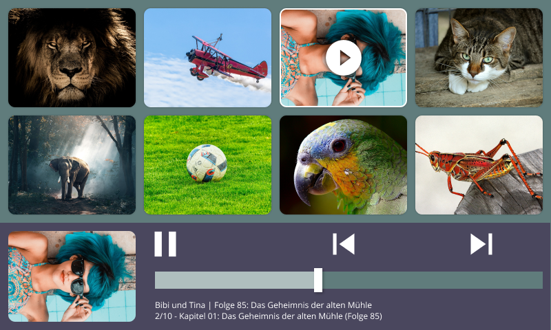

# Children Audio Library

Web based audio library for children. Made for the Raspberry Pi 7" Touchscreen.

## Goals

- [ ] provide a children friendly touch interface for browsing and listening to music and audio books
- [ ] make it work on the Raspberry PI Model 3 B together with the 7" Touchscreen
- [ ] make it work on the included Chromium from Raspbian in kiosk mode
- [ ] make it startup on boot and prevent escaping (escaping should only be possible with a keyboard)
- [ ] make it read playlists/directories from a list of library folders (including external storages)
- [ ] make it automaticly download cover art from online sources or use existing cover art images
- [ ] make it optionally shutdown system automaticly after given time of inactivity
- [ ] make it work completely offline
- [ ] provide a CLI to rescan library folder(s) and stop/start/maintain it
