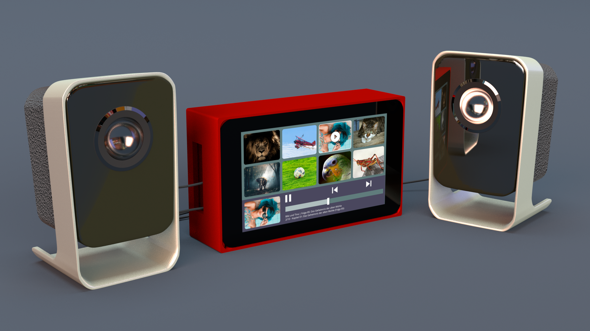
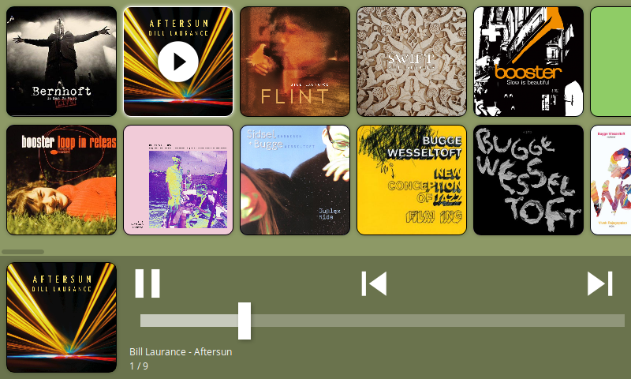

# Children Audio Library

Web based audio library for children. Made for the Raspberry Pi 7" Touchscreen.





## Goals

- [x] provide a children friendly touch interface for browsing and listening to music and audio books
- [x] make it work on the Raspberry PI Model 3 B together with the 7" Touchscreen
- [ ] make it work on the included Chromium from Raspbian in kiosk mode
- [ ] make it startup on boot and prevent escaping (escaping should only be possible with a keyboard)
- [x] make it read directories from a list of library folders (including external storages)
- [x] make it automaticly download cover art from online sources or use existing cover art images
- [ ] make it optionally shutdown system automaticly after given time of inactivity
- [x] make it work completely offline
- [x] provide a CLI to rescan library folder(s) and stop/start/maintain it

## Configuration

Copy `config.example.json` to `config.json` and adjust to your needs.
It is recommended to have access to a last.fm and discogs developers account to download missing cover art.

## Develop

```bash
LIBRARY_PATH=~/Music docker-compose up --build
```

Then in a second terminal do the following to scan the music library

```bash
docker-compose exec app
npm run scan
```

Now open your browser pointing to `http://localhost:8000`.

## Production

Do the configuration from above and then run:

```bash
npm run scan
npm start
```

This will scan the library and then start the server.

Now open your browser pointing to `http://localhost:8000`.

To rescan the media library run:

```bash
npm run scan
```

It is recommended to add the `npm run scan` to a cron job or trigger it manually once you've added/changed the media library.
